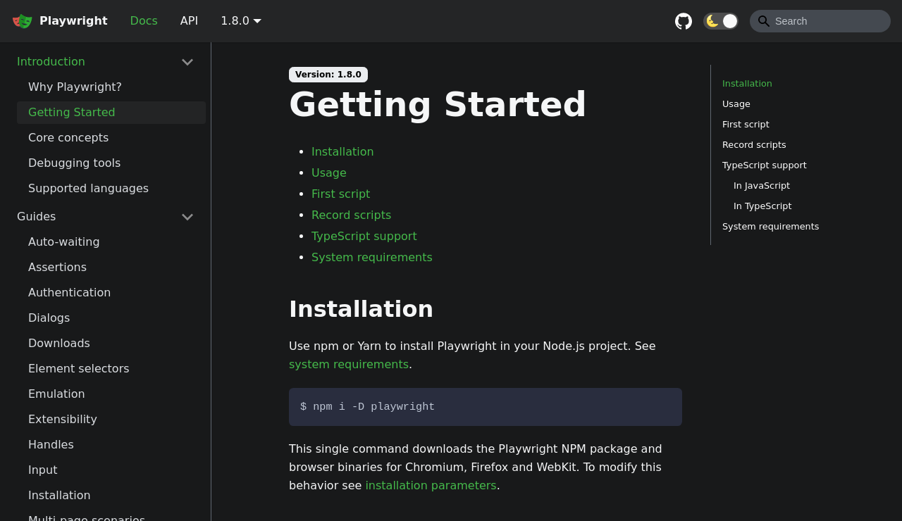

# 🎭 Test automation with Playwright & Mocha 

Howto run end-to-end testing with Playwright & Mocha

[](https://asciinema.org/a/392786?autoplay=1)

## Prerequisite

* Install node [Node](https://nodejs.org/en/download/)

## Initalize the project

* Clone this project
```
git clone https://github.com/yyvess/playwright-mocha.git
cd playwright-mocha
```

* Run npm install to download project dependancies
```
npm install
```

## Usage

### Run tests on headless mode with Chromium
```    
npm test
```

### Run test on headless mode with Firefox

```    
npm run test:firefox
```

### Run tests on 'head' mode
Run tests with browser visible
```
npm run test:head
```

### Run tests with watch mode
Rerun tests on file changes.
```
npm run test:watch
```

### Run your test on Github Actions
[main.yml](https://github.com/yyvess/playwright-mocha/blob/main/.github/workflows/main.yml)

### Record your tests

* [Record videos](https://playwright.dev/docs/videos?_highlight=record)
* [Take screenshoots](https://playwright.dev/docs/screenshots/#Screenshots)
[](captures/videos.webm?raw=true)

## External documentation 

* [Playwright](https://playwright.dev/)
* [Mocha](https://mochajs.org/)
* [Chai expect](https://www.chaijs.com/api/bdd/)
